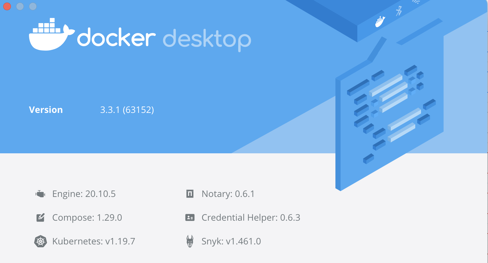
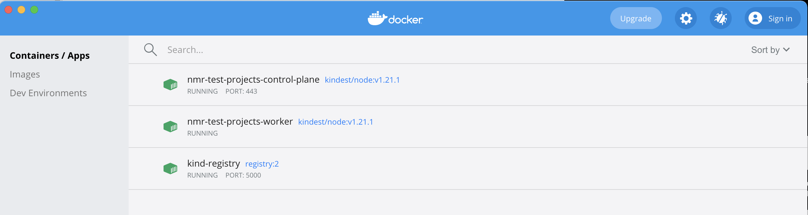

# Numerator Interview Project

The project runs on a workstation/laptop and there is a pre-built environment that you can create using the instructions below.

#### Prerequisites

* docker install
* kubectl
* terraform >=0.14.7
* Laptop running MacOS, Windows or Linux.
* Adjust the Docker environment to allow for 2CPUs and 4GB RAM.
* Internet connection (to download public docker images)

These projects have been tested on:
1. 2018 15-inch MacBook Pro w/ 6-core i7 and 16GB RAM
2. Windows 10

### KinD Kuberentes Cluster

This project has some scripts set aside to launch a local Kubernetes Cluster built using [KinD](https://kind.sigs.k8s.io/).  You can use the kubernetes with Docker Desktop or another provider that you have access to.

#### Starting Cluster

Ensure you have Docker running.  Note, if you're using Docker Desktop ensure it is not running it's own Kubnernetes cluster as this seems to interfere with Kind as the host computer can become sluggish and slow leading to timeouts.



##### Windows
```start-cluster.bat```

##### MacOS
```./start-cluster.sh```

```
#> ./start-cluster.sh
Unable to find image 'registry:2' locally
2: Pulling from library/registry
ddad3d7c1e96: Pull complete
6eda6749503f: Pull complete
363ab70c2143: Pull complete
5b94580856e6: Pull complete
12008541203a: Pull complete
Digest: sha256:aba2bfe9f0cff1ac0618ec4a54bfefb2e685bbac67c8ebaf3b6405929b3e616f
Status: Downloaded newer image for registry:2
0f282d6033b71debb6eafbb4a9d081e706025659f622d104c13df56afe1fd00a
Registry Host: kind-registry
Creating cluster "nmr-test-projects" ...
 ✓ Ensuring node image (kindest/node:v1.21.1) 🖼
 ✓ Preparing nodes 📦 📦  
 ✓ Writing configuration 📜
 ✓ Starting control-plane 🕹️
 ✓ Installing CNI 🔌
 ✓ Installing StorageClass 💾
 ✓ Joining worker nodes 🚜
```

Once Kind has started, you should see three related Docker Containers running on your laptop or workstation...



#### Connecting with kubectl
```kubectl --kubeconfig ./nmr-local```

#### Destroying Cluster

##### Windows
`delete-cluster.bat`

##### MacOS
`./delete-cluster.sh`

---
## Disclaimer

##### Optional Participation
This project is an optional part of any larger training and recruitment process.

##### Equipment

1. You will require an average personal work computer (eg: laptop) or equivalent with 4 CPUs and 16GB RAM and ~20GB of disk space free.  Access to basic internet download public (free) Docker container images.  
2. You do not need to use any paid services (eg: AWS, AzureAD, GCP) to accomplish these tasks... although if you have access to them you may decide to use third party services.  

##### Notes on using Third Party Services & Charges
1. Numerator is not responsible or liable for any charges incurred in third party accounts you create for this challenge.  Ensure you have removed any services (such as compute or databases) that may incur charges once the free tier quota has been exceeded.
2. If you already have access to an Azure, GCP, or AWS Account then please ensure you are allowed to use it for personal-use during this project.
3. Do NOT include proprietary third party services or product that you do not have right to distribute.  
