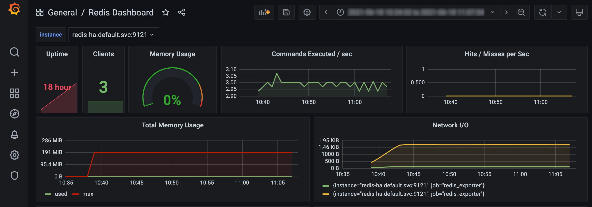
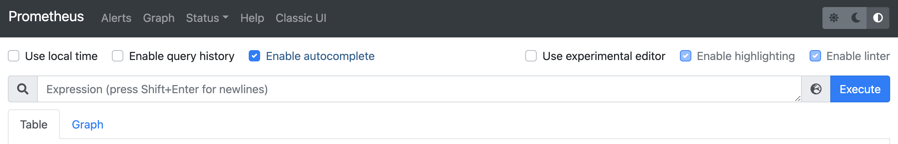
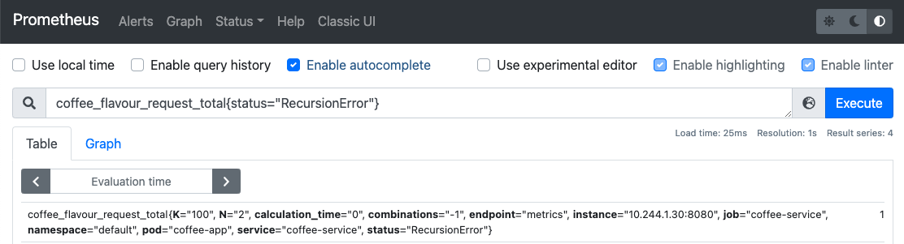

# GDE2 Prometheus Stack Configuration



## Project Summary

The goals of this project are to diagnose and correct some configuration issues and then identify some key metrics using the open-sourced Prometheus stack ([kube-prometheus-stack](https://github.com/prometheus-community/helm-charts/tree/main/charts/kube-prometheus-stack)).

There are four parts to this project:

* Part 1 - Networking & Configuration
* Part 2 - Prometheus Configuration of Third Party Metrics
* Part 3 - Code Analysis
* Part 4 - Microservice Deployment


### Project Deliverables

The project should take no more than 3 to 4 hours.  Once complete, zip up your work including:

1. The original project with the changes and additions required to complete this project.
2. Documentation, screenshots and any supporting material you think relevant to help explain how you tackled the challenge.
3. If you do not complete all the steps but it is important to communicate how far you got and where you got stuck.
4. Upload all materials in ONE zip file to the Google Folder shared with you.  Please name the zip file as follows: `<YYYYMMDD>_<firstname>_<surname>.gde.project2.completed.zip`

Please do not zip up or include the `.terraform/` folders, large data sets, container images or similar.  The zip file should not be any larger ~10MB.

We look forward to seeing your solutions and creativity and good luck!

---

### Guidance

Please attempt to complete each of these parts and document what was wrong and how it was addressed.  In some sections the tasks are focused on troubleshooting and in others require you to add missing infrastructure.

This project should take no longer than ~3-4 hours to complete.

#### Disclaimer

This project is part of a larger body of work from Numerator Global DevOps Team.  Reproduction or distribution of this work in part or in full is not allowed.

##### Optional Participation
This project is an optional part of any larger training and recruitment process.

##### Equipment

1. You will require an average personal work computer (eg: laptop) or equivalent with 2 CPUs and 8GB RAM and ~20GB of disk space free.  Access to basic internet download public (free) Docker container images.  
2. You do not need to use any paid services (eg: AWS, AzureAD, GCP) to accomplish these tasks... although if you have access to them you may decide to use third party services.  

##### Using Third Party Services, Fees and Charges

1. Numerator is not responsible or liable for any charges incurred in third party accounts you create for this challenge.  Ensure you have removed any services (such as compute or databases) that may incur charges once the free tier quota has been exceeded.
2. If you already have access to an Azure, GCP, or AWS Account then please ensure you are allowed to use it for personal-use during this project.
3. Do NOT include proprietary third party services or product that you do not have right to distribute.  

---

### Part 1 - Networking & Configuration

This section of the challenge is focused on configuration changes to make the cluster and services within it operate correctly.  The Terraform project will install many resources and some of which require additional configuration changes.


<span style="color:grey">QUESTION 1</span>

Run the Terraform project `projects/gde2/terraform/` and successfully deploy and then create list of resources to a file.

<span style="color:grey">QUESTION 2</span>

Call [test link](http://localhost/cowsay?msg=hello&kind=three-eyes) and note down the response.


<span style="color:grey">QUESTION 3</span>

Debug and fix the service so it responds properly using the test-link URL given in Part 1 Question 2.


<span style="color:grey">QUESTION 4</span>

Provide example of a short bash script that will call the test link URL in Part 1 Question 2 and save the response to a text file called test.output.txt.


<span style="color:grey">QUESTION 5</span>

Configure redis to require clients to use the password `redis1234`


<span style="color:grey">QUESTION 6</span>

There are three services `foo`, `bar` and `test`, that Terraform constantly attempts to re-apply. What is the cause of this state change and how can this be fixed?


<span style="color:grey">QUESTION 7</span>

There are two nodes in the Kind kubernetes cluster. Change the service `app-foo` application so that when it starts it will run on the `nmr-test-projects-kind-control-plane` node.

<span style="color:grey">QUESTION 8</span>

Provide the kubectl command to show which node the app-foo service is running.

<span style="color:grey">QUESTION 9</span>

In steady state, what is the maximum amount of memory used at runtime by the `test-app` and `redis` server?

<span style="color:grey">QUESTION 10</span>

Change the Prometheus data retention from 10 days to 30 days.

---

### Part 2 - Prometheus Configuration of Third Party Metrics



This part is focused on configuration of Prometheus, enabling metrics from Redis server and making some metric queries using Prometheus GUI.

The following URLs should work (without any configuration changes) on your workstation...
1. Prometheus Console: [http://localhost/prometheus/](http://localhost/prometheus/)
2. Grafana Dashboard: [http://localhost/grafana/](http://localhost/grafana/)

<span style="color:grey">QUESTION 1</span>

Enable Redis prometheus metrics exporter and allow Prometheus to verify the redis metrics are available in Prometheus Console.


<span style="color:grey">QUESTION 2</span>

What is the approximately value for `redis_memory_used_peak_bytes`?

<span style="color:grey">QUESTION 3</span>

What is the password for the Grafana dashboard and where is it stored?

<span style="color:grey">QUESTION 4</span>

Create a redis dashboard in Grafana that looks similar the screenshot at the top of this page.  List what steps are required to successfully import this dashboard.

<span style="color:grey">QUESTION 5</span>
On the Redis Dashboard, which type of Command is making the most calls per second over time?

---

### Part 3 - Code Analysis

This part of the project to assess your familiarity with programming and in particular identify limitations or issues with sample code.

Note, the sample code here is for illustrative purposes and may implement sub-standard or erroneous algorithms.  It is important to think about how the code is used and how the system may behave as a result.

<span style="color:grey">Overview</span>

In the `src` folder in this project there is a small python program which meets the following requirements:

1. There are N different coffee flavours to start building new flavour combinations.
2. A combination of two or more flavours gives a new flavour.
3. A maximum of K individual flavours can be combined to create new flavour.

For example, if there are 5 total (N=5) starting flavours and each new flavour can have a maximum of 2 (K=2) flavours combined.  There is a total of 15 flavours that can be created.

Source Code: [src/flavour.py](./src/flavour.py)
```
def fact(N, fact_val):
    if N==0:
        return fact_val
    return fact(N-1, fact_val*N)


def Flavours(N, K):
    ans = 0
    upper = fact(N, 1)
    for i in range(2, K+1):
        denominator1 = fact(i, 1)
        denominator2 = fact(N-i, 1)
        combinations = upper/(denominator2*denominator1)
        ans+=combinations
    return int(ans+N)
```

<span style="color:grey">QUESTION 1</span>

Does the function `Flavours` always return the correct result?

<span style="color:grey">QUESTION 2</span>

Can you suggest any improvements to the algorithm and why would it be an improvement?


<span style="color:grey">QUESTION 3</span>

How would you provide a list of coffee flavours so that the REST API could give you the names of the coffee flavour combinations?

---

### Part 4 - Microservice Deployment

This part of the challenge is focused on the analysis of a simple service that has a number of limitations.  The service runs within the cluster and provides a REST API for clients to call.

Remember, when you installed the Kind cluster, it also installed a local Docker Registry that the cluster can use.  For more details see [Kind-Registry](https://kind.sigs.k8s.io/docs/user/local-registry/) help page. Alternatively you can use kind to load images into the cluster.

<span style="color:grey">QUESTION 1</span>

Create an application that can execute the coffee flavour algorithm defined in Part 3 in an on demand REST API.  The application should run from within the kubernetes cluster and accessible on your workstation at [http://localhost/coffee/flavour/count/{N}/{K}](http://localhost/coffee/flavour/count/5/2).

<span style="color:grey">QUESTION 2</span>

Update the REST API Service to generate a Prometheus metric `coffee_flavour_request` that captures the following information per request:

1. N - the N value for the given request.
2. K - the K value for a given request.
3. combinations - number of combinations for a given N and K.
4. calculation_time - the length of time taken to generate combinations.
5. error - metric tracking errors for the service.

<span style="color:grey">QUESTION 3</span>

Create an Alertmanager alert whenever `coffee_flavour_request` indicates at least one error has occurred within the past 2 minutes.

<span style="color:grey">QUESTION 4</span>

Define a set of REST API calls to the [http://localhost/coffee/flavour/count/{N}/{K}](http://localhost/coffee/flavour/count/2/6) service that will generate at least one failure logged as a `coffee_flavour_request` metric in Prometheus console as shown in the screenshot below.



<span style="color:grey">QUESTION 5</span>

Programatically identify what upper bound value of N will create a RecursionError with the original algorithm implementation.  

Document your approach and provide a test script to find this upper bound.
